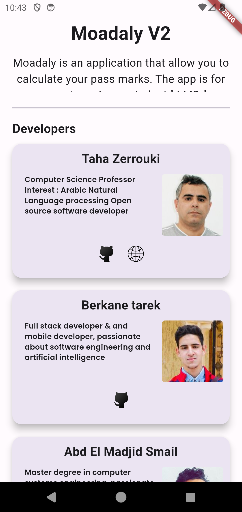
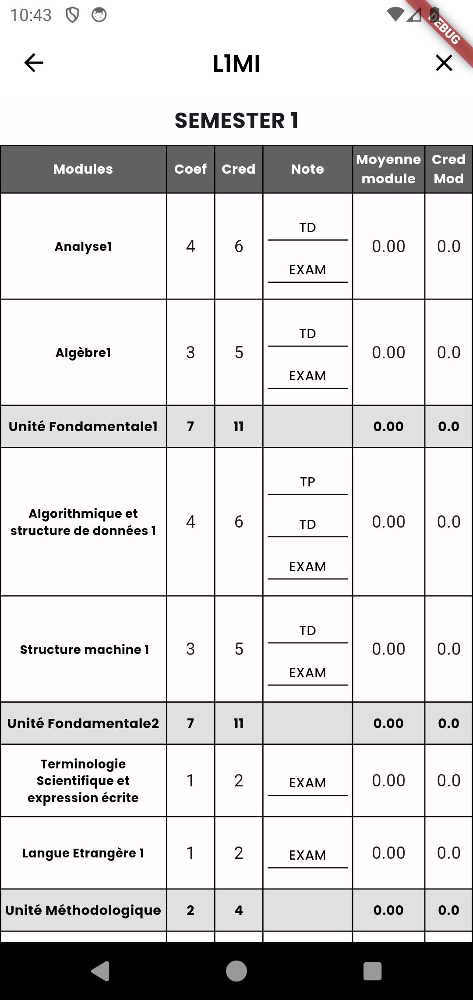
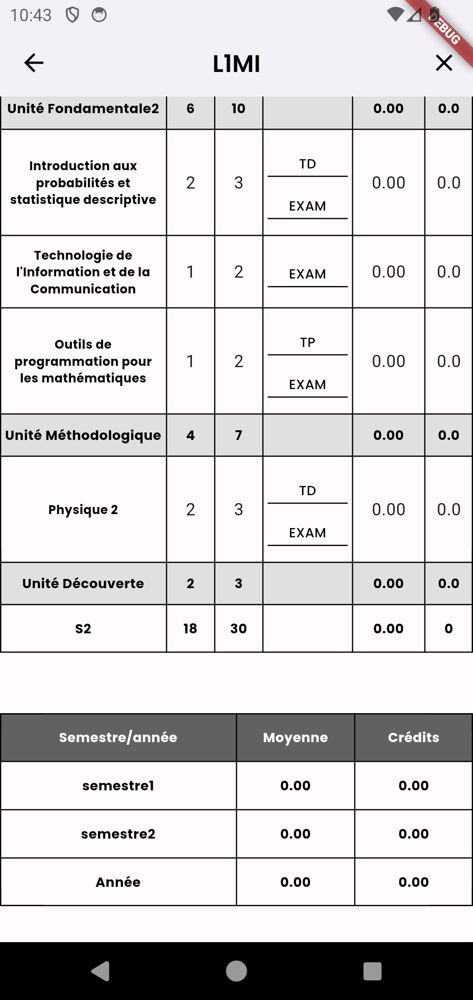
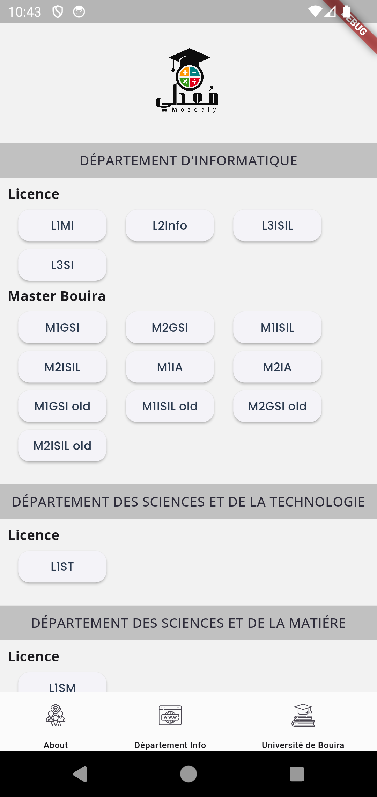

# Moadaly معدلي
محاكي حساب المعدل لطلبة نظام ل.م.د تخصص رياضيات وإعلام آلي
يستعمل لكل الجامعات التي تتابع نفس المنهاج لميدان الرياضيات والإعلام الآلي في الجزائر،

* فيه جزئية خاصة بتخصصات الماستر في الإعلام الآلي بالبويرة،

apk : [moadaly_app](https://drive.google.com/file/d/1bb2PToHU4kCU2Vi3AocOX97UP7AKpUp3/view?usp=sharing)

Try it :[moadaly-web](https://madjsmail.github.io/moadaly/) 

See our design : [design](https://github.com/Sho-Oter/dynamic-grade-average-calculator)

See  : [SourceCode](https://github.com/Abdelmadjidsmail/moadaly)

## App

    
     

     
     

## Moadaly

* is a web application that allow you to calculate your pass marks. The app is for computer science student " LMD "   
* تطبيق ويب لحساب المعدل الفصلي و السنوي للسنة الاولى  رياضيات وإعلام آلي وسنوات اعلام الى   نظام [LMD] الجزائر 

* التخصصات المدعومة حاليا:
  * L1 MI
  * L2 Info
  * L3 SI + ISIL
  * M1 ISIL+ GSI + IA
  * M2 ISIL + GSI + IA
* تمت إضافة السنة الأولى في ميداني العلوم والتكنولوجيا وميدان علوم المادة ST/SM

## Issues
Testing is much appreciated. Please post any issue you find in the [Issue tracker](https://github.com/tarek-berkane/moadaly_v2/issues).

## Project Implementation by 
* [**Smail Abd El Madjid**](https://github.com/Abdelmadjidsmail/)
* [**Taha Zerrouki**](https://github.com/linuxscout/)
* [**Tarek Berkane**](https://github.com/tarekDZ2019) *mobile app*
* [**Aouf Ali**](https://github.com/Sho-Oter)  *design* 

## Built With
* [flutter/dart]

## Contribution
* Adapt this app for more specialities (ST, SM, etc..)

